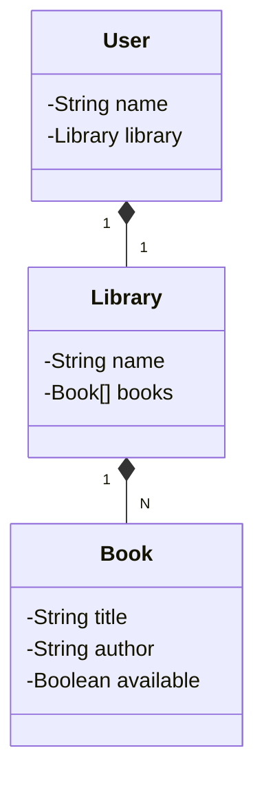

# Dio Api Rest Nuvem

Java RESTful API criada como desafio de projeto da DIO **Publicando Sua API REST na Nuvem Usando Spring Boot 3, Java 17 e Railway**.

## Principais Tecnologias
 - **Java 17**: Utilizaremos a versão LTS mais recente do Java para tirar vantagem das últimas inovações que essa linguagem robusta e amplamente utilizada oferece;
 - **Spring Boot 3**: Trabalharemos com a mais nova versão do Spring Boot, que maximiza a produtividade do desenvolvedor por meio de sua poderosa premissa de autoconfiguração;
 - **Spring Data JPA**: Exploraremos como essa ferramenta pode simplificar nossa camada de acesso aos dados, facilitando a integração com bancos de dados SQL;
 - **OpenAPI (Swagger)**: Vamos criar uma documentação de API eficaz e fácil de entender usando a OpenAPI (Swagger), perfeitamente alinhada com a alta produtividade que o Spring Boot oferece;
 - **Railway**: facilita o deploy e monitoramento de nossas soluções na nuvem, além de oferecer diversos bancos de dados como serviço e pipelines de CI/CD.

## Diagrama de Classes (Domínio da API)

## IMPORTANTE

Este projeto tem como base o projeto [Santander Dev Week 2023 Java API](https://github.com/falvojr/santander-dev-week-2023).

O domínio do problema foi modificado para um usuário que procura livros em uma biblioteca.

Também foram feitas modificações no projeto para o uso do plugin do lombok.